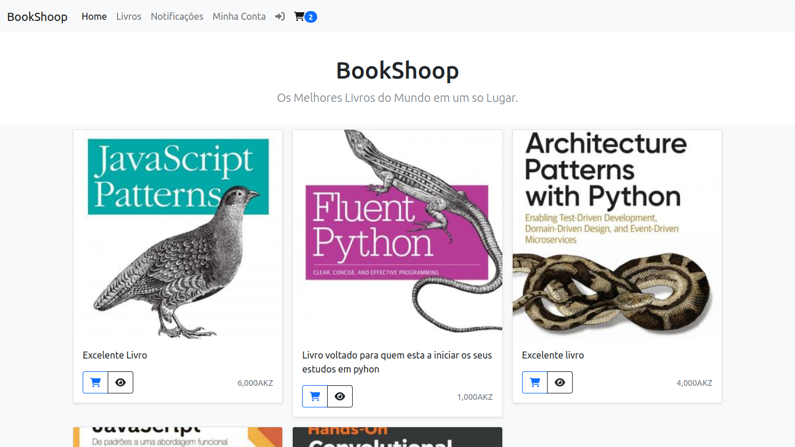
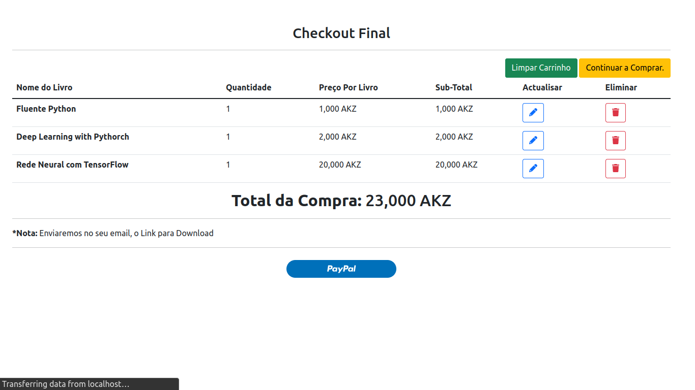
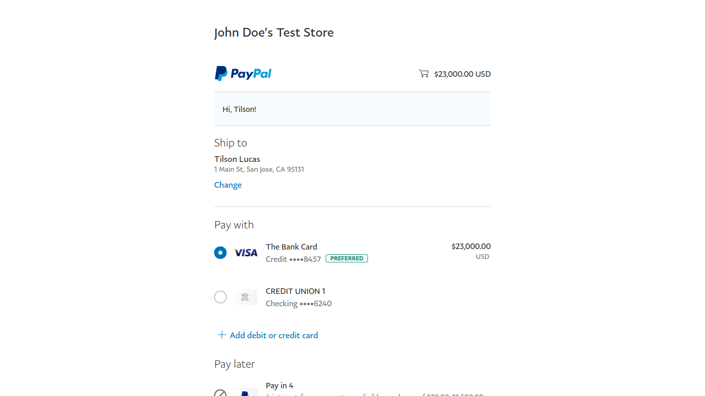
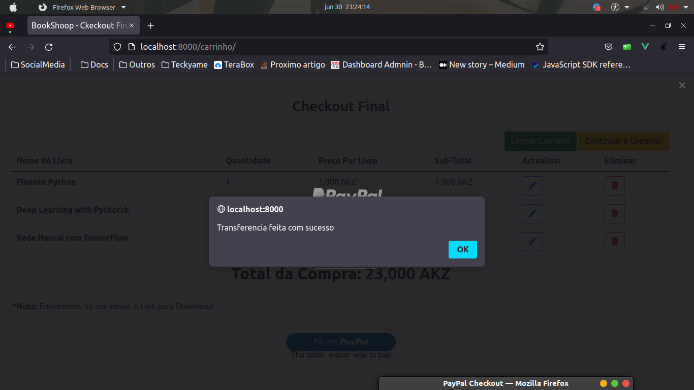
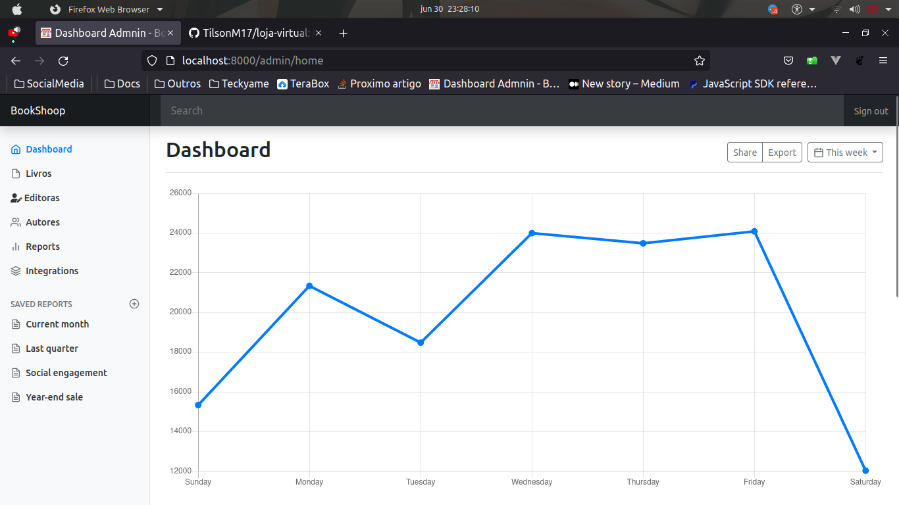
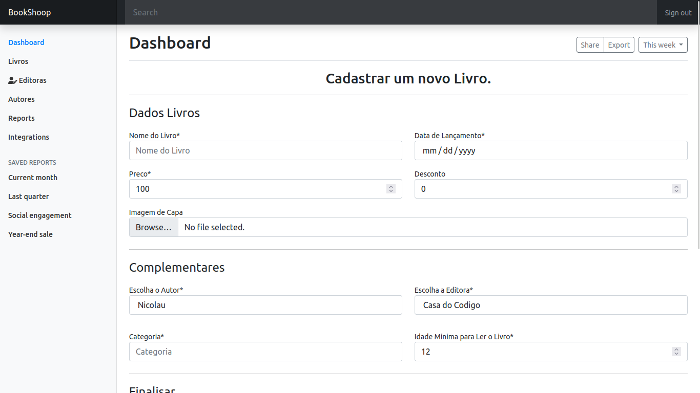

# Loja Virtual (Loja de Livros)

## Visão geral

Livraria Virtual criada com php, mysql, vue.js.

Durante o desenvolvimento usei os seguintes ***packages*** : 

 - [league/plates]() - Para o Template Engine
 - [izniburak/router]() - Para um sistema de rotas.
 - [doctrine/orm]() - ORM
 - [phpmailer/phpmailer]() -  Disparo e envio de Email

 - [phpunit/phpunit]() -  Testes Unitarios

Na pasta `Material` tem um arquivo `db.sql`, este ficheiro contem o backup da base de dados. Para ter acesso a base de dados abra o terminal e rode os seguintes comandos.
    
    //Entre o shell do mysql
    $ mysql -u root -p

    //Crear a Base de Dados com o nome 'bd_loja'
    mysql> create database db_loja;

    //Restaurar a partir do arquivo de backup
    $ mysql -u root -p db_loja < db.sql

## Rodar

Para rodar o projecto rode o seguinte comando: 

    $ composer install
    $ php turbo

Este comando vai baixa as depencias do propjecto e vai  iniciar o servidor embutido do php com o ***target*** para a pasta **public** que é a porta de entrada para a nossa aplicação.

## Screenshots Usuario

### Tela inicial com Usuario Logado

### Checkout Final, integração com Paypal

### Depois de Fazer Login no Paypal Sandbox, escolher a bandeira de pagamento

### Mensagem de Sucesso

---

## Tela do Admin

### Analise de Vendas com ApexCharts.js

### Cadastro de Novos Livros

------

## Resto é conversa